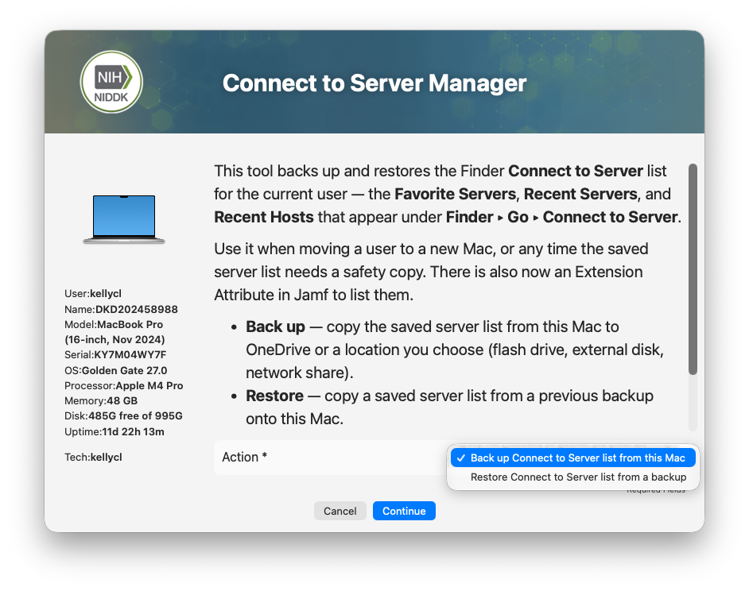
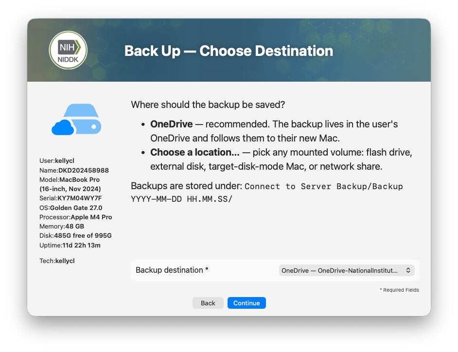
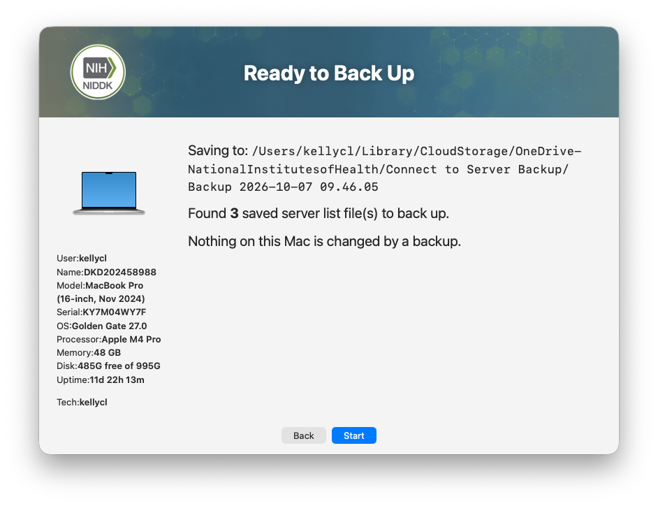
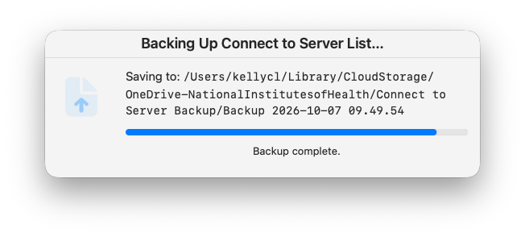
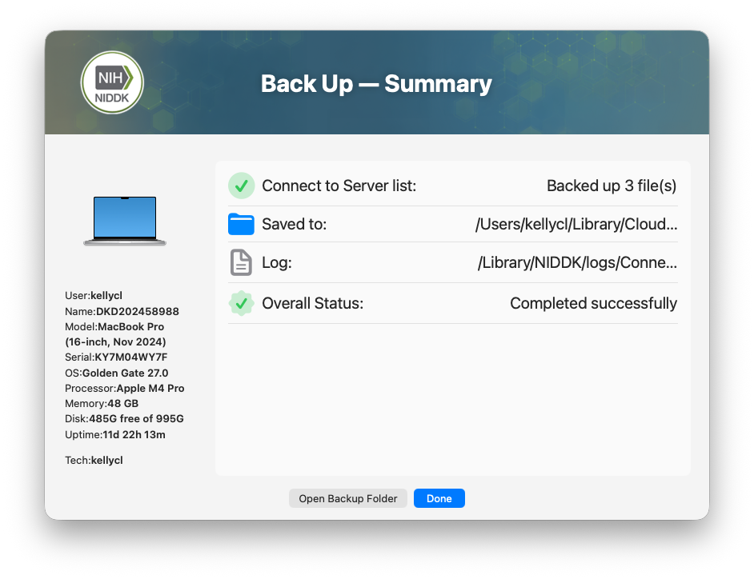

## NIDDK Connect to Server Manager Swift Dialog
Tool to backup users Recent and Favorite "Server" list under the GO-Connect to Server Menu
Creates a folder called Connect to Server Backup. 
Then creates a dated folder for the backup and copies com.apple.LSSharedFileList.FavoriteServers.sfl4 and the com.apple.LSSharedFileList.RecentHosts.sfl4 com.apple.LSSharedFileList.RecentServers.sfl4
Allows restoring from a previously saved backup. 
 
  
  *****NOTE This will OVERWRITE the Recents and Favorite server list on the system. 

NOTES::
 - Gives the option to backup or restore a previous backup.
 - Checks if OneDrive is signed into
 - Gives option to backup to OneDrive or choose an alternative Destination
 - Provides a quick summary 
 - Shows a basic progress dialog
 - Provides an after backup Summary
   

| **Version**|**Notes**|
|:--------:|-----|
| 1.0 | Initial Verison
||      
||       NIDDK Connect to Server Manager V1.0 Readme.md
